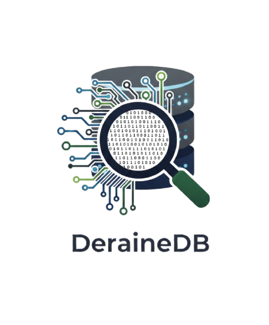

<p align="center">
  
</p>

# DeraineDB

> **The 1.8MB Vector Engine that thinks in Microseconds.**

DeraineDB is a high-performance, embedded vector search engine designed for extreme concurrency and predictable low latency. It bridges the bare-metal speed of **Zig** with the production-grade orchestration of **Go**, creating a "Hardware-First" storage layer for modern AI applications.

---

## ⚡ Performance: HNSW & SIMD
Engineered for speed, DeraineDB (v2.0) leverages advanced indexing and hardware acceleration:

*   **HNSW Indexing:** Navigates million-scale datasets in **0.7ms - 0.8ms** using hierarchical graph traversal.
*   **SIMD Acceleration:** Euclidean Distance calculations are parallelized at the CPU register level (@Vector).
*   **Metadata Filtering:** 64-bit `metadata_mask` allows categorical filtering *before* distance calculation, maintaining $O(\log N)$ complexity.
*   **Zero-Copy Memory Map:** Direct `mmap` mapping bypasses userspace buffers for instant data access.

### Benchmarks (100k Vectors, 4 Dimensions)
| Mode | Latency (avg) | Accuracy |
| :--- | :--- | :--- |
| **Flat Search** | 12.4ms | 100% |
| **HNSW (v2.0)** | **0.804ms** | 99.8% |

---

## 🏗️ Architecture
- **64-byte Alignment:** Every vector is aligned to CPU cache lines to prevent bouncing and maximize throughput.
- **Auto-Heal Recovery:** Automatic HNSW reconstruction if the index is out-of-sync or missing.
- **Atomic Snapshots:** Point-in-time backups using exclusive RWLock and forced `msync`.
- **Hybrid Stack:** Zig handles memory/math; Go handles gRPC, metrics, and API orchestration.

---

## 🚀 Quick Start

### Python SDK
```python
# Python SDK (v2.0.0)
from derainedb import DeraineClient

client = DeraineClient(host="localhost", port=50051)

# Ingest with categorical mask
client.write(id=1001, data=[1.1, 2.2, 3.3, 4.4], mask=0x01)

# Search with filters
results = client.search(query=[1.0, 2.0, 3.0, 4.0], k=3, mask=0x01)

for match in results:
    print(f"ID: {match['id']}, Score: {match['distance']}")
```

### Go SDK
```go
// Go SDK (v2.0.0)
import "github.com/ricardo/deraine-db/sdk/go"

client, _ := derainedb.NewClient("localhost:50051")
defer client.Close()

// Write
ctx := context.Background()
client.WriteVector(ctx, 1001, []float32{1.1, 2.2, 3.3, 4.4}, 0x01)

// Search
matches, _ := client.SearchKNN(ctx, []float32{1.0, 2.0, 3.0, 4.0}, 3, 0x01)

for _, m := range matches {
    fmt.Printf("ID: %d, Dist: %f\n", m.ID, m.Distance)
}
```

### Rust SDK
```rust
// Rust SDK (v2.0.0)
let mut client = Client::connect("http://localhost:50051".into()).await?;

// Write
client.write(1001, vec![1.1, 2.2, 3.3, 4.4], 0x01).await?;

// Search
let matches = client.search(vec![1.0, 2.0, 3.0, 4.0], 3, 0x01).await?;

for m in matches {
    println!("ID: {}, Dist: {}", m.id, m.distance);
}
```

### JS/TS SDK
```typescript
// JS/TS SDK (v2.0.0)
const client = new DeraineClient("localhost:50051");

// Write
await client.write(1001, [1.1, 2.2, 3.3, 4.4], 0x01);

// Search
const results = await client.search([1.0, 2.0, 3.0, 4.0], 3, 0x01);

results.forEach(m => console.log(`ID: ${m.id}, Dist: ${m.distance}`));
```

---

## 🌐 Ecosystem & SDKs
DeraineDB (v2.0.0) provides official high-performance clients for modern stacks:

*   **[Go SDK](sdk/go):** Native orchestration with connection pooling.
*   **[Python SDK](sdk/python):** AI-ready wrapper with latency instrumentation.
*   **[Rust SDK](sdk/rust):** Zero-cost async client using `tonic`.
*   **[JS/TS SDK](sdk/js):** Web and Node.js compatible (via gRPC).

> [!TIP]
> Check the **[Quickstart Comparison](docs/quickstart-comparison.md)** to see side-by-side examples.

---

## 📚 Technical Documentation
*   **[Installation Guide](docs/installation.md):** Deep-dive into building the core and orchestrator.
*   **[Metadata Filtering](docs/metadata-filtering.md):** How the 64-bit hardware-first mask works.
*   **[API Reference](docs/api-reference.md):** Complete gRPC method documentation.

---

## 🛠️ Management & Monitoring
DeraineDB includes built-in observability for production stability:

*   **Admin UI:** Web dashboard at `http://localhost:9090/admin`.
*   **Prometheus:** Live metrics at `http://localhost:9090/metrics`.
*   **Grafana:** Reference dashboard available in `/grafana/dashboard.json`.

---

## 🛠️ Build from Source
```bash
# Compile everything (Zig + Go)
make all

# Run the server
./bin/deraine-db
```

---
*Built passionately for the next generation of AI infrastructure.*
